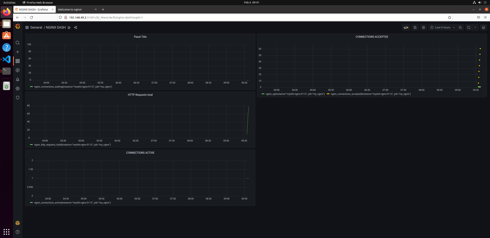

# prometheus-grafana-helm-chart
Deploys nginx, prometheus and grafana with automated nginx monitoring dashboard configuration.
Prometheus is avaliable at the port 31002, while grafana is at the port 31001. Grafana for some reason takes a bit of time to be avaliable, something about 2 mins for me. 
There are also nginx metric and nodeexporter metric avaliable outside too. 

